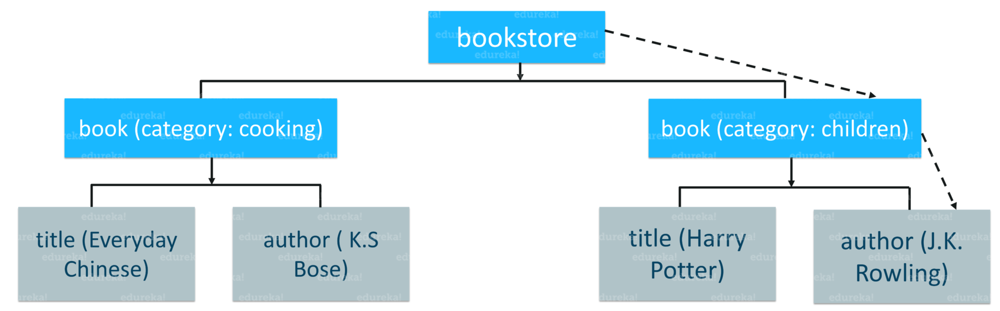

# XPath

<div align="center">
  
  <br />
  <div>The <b>best way</b> to <b>locate elements</b> on a <b>webpage</b></div>
  <br />
</div>

## Table of Contents

<!-- START doctoc generated TOC please keep comment here to allow auto update -->
<!-- DON'T EDIT THIS SECTION, INSTEAD RE-RUN doctoc TO UPDATE -->

- [What is XPath](#what-is-xpath)
- [References](#references)

<!-- END doctoc generated TOC please keep comment here to allow auto update -->

## What is XPath

> `XPath` is also called as `XML Path`, a **language** to **query XML documents**.

<br />

<!-- AUTO-GENERATED-CONTENT:START (CODE:src=labs/bookstore.xml) -->
<!-- The below code snippet is automatically added from labs/bookstore.xml -->

```xml
<!-- An example of an XML document where you have different "tags" and "attributes" -->
<!-- Start with a "tag" called the "bookstore", which is also an "element" or a "node" -->
<bookstore>
  <book category="cooking">
    <title lang="en">Everyday Chinese</title>
    <author>K.S.Bose</author>
  </book>
  <book category="children">
    <title lang="en">Harry Potter</title>
    <author>J.K. Rowling</author>
  </book>
</bookstore>
```

<!-- AUTO-GENERATED-CONTENT:END -->

<div align="center">
  
  <br />
  <div>Visualize the XML document in a tree-like structure</div>
  <br />
</div>

<br />

Here is an **XPath** query to locate the `author` of a `book` whose `category` is `children`:

```xpath
/bookstore/book[@category='children']/author
```

## References

- [How to Get Started with XPath in Selenium](https://www.edureka.co/blog/xpath-in-selenium)
- [Xpath in Selenium | Selenium Xpath Tutorial | Selenium Xpath Examples](https://www.youtube.com/watch?v=9-iVt0MIqNY)
- [XPath in Selenium WebDriver](https://www.guru99.com/xpath-selenium.html)
