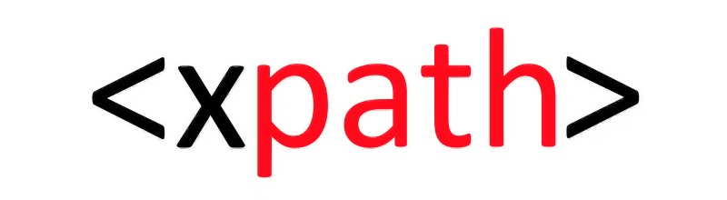
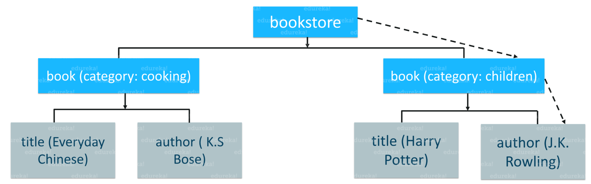
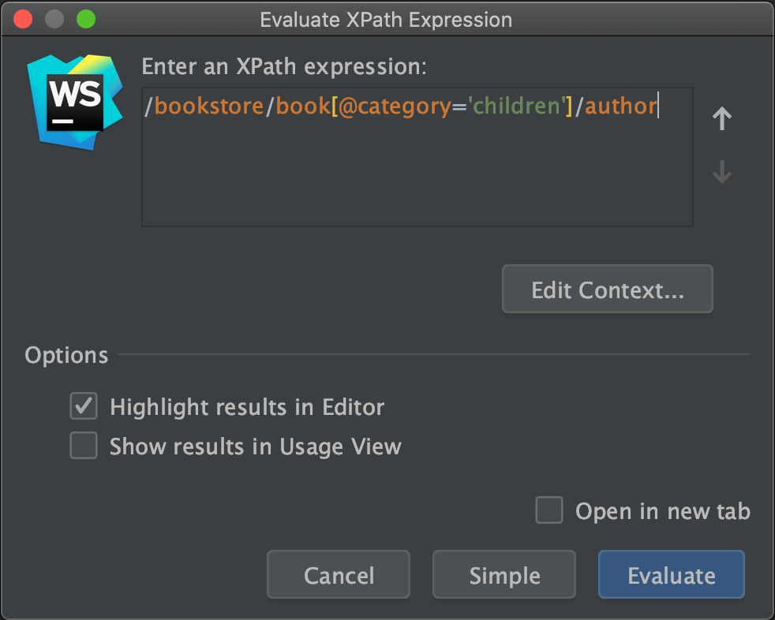
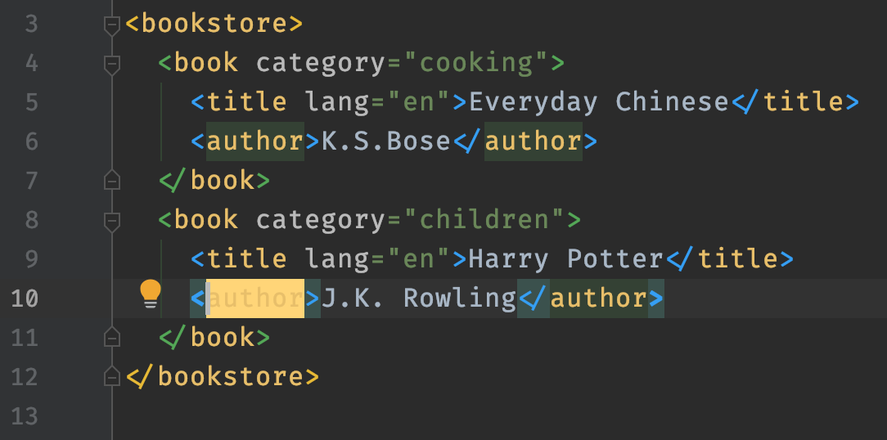
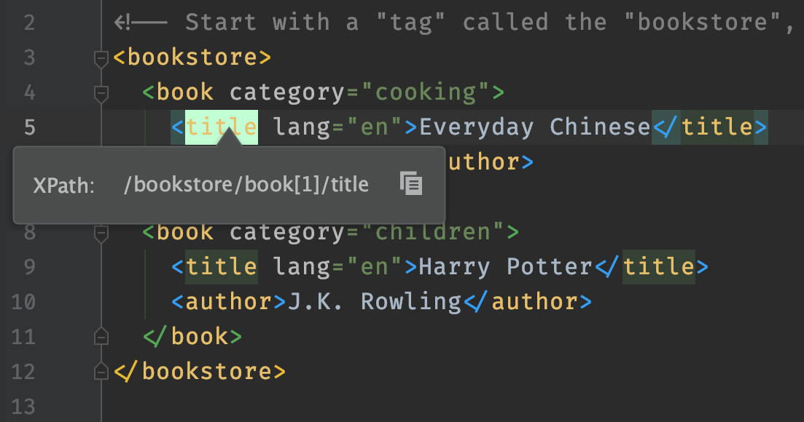
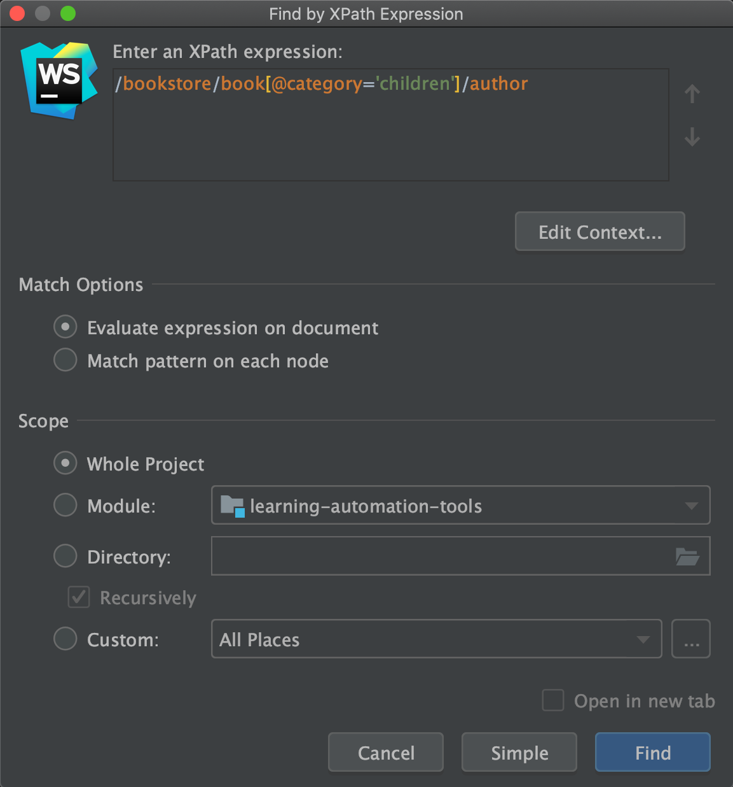
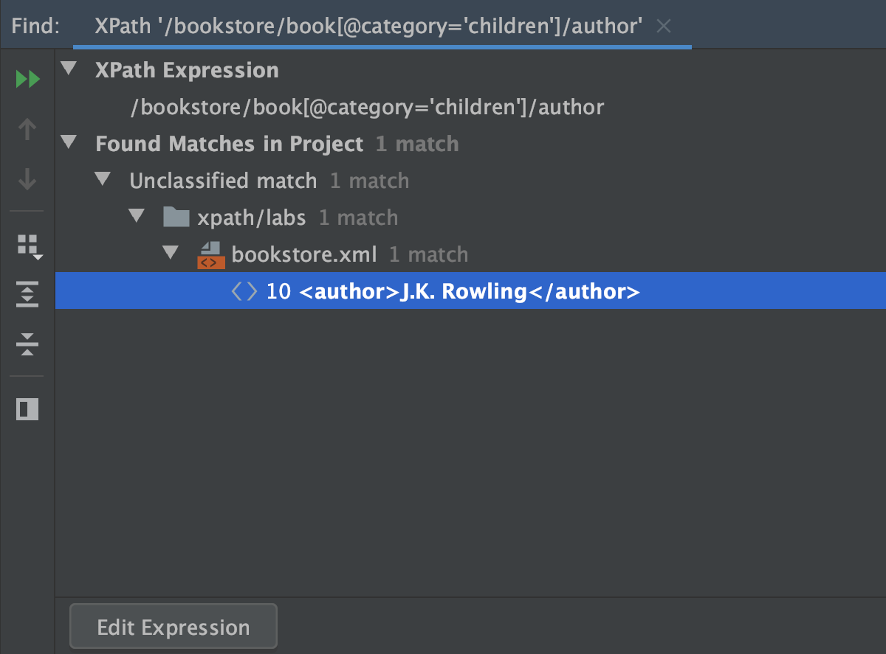
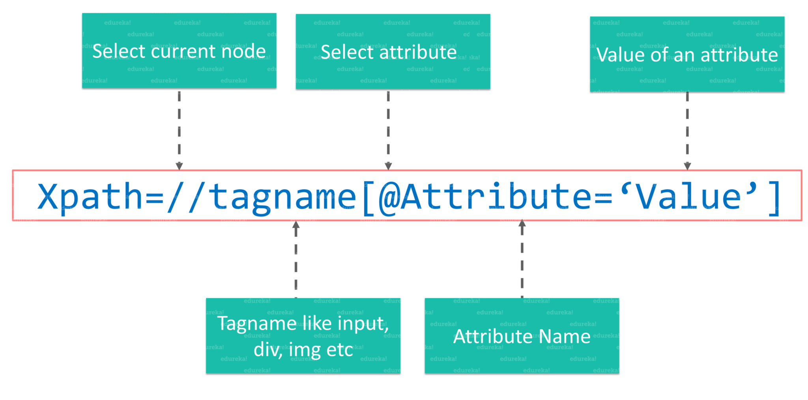

# XPath

<div align="center">
  
  <br />
  <div>The <b>best way</b> to <b>locate elements</b> on a <b>webpage</b></div>
  <br />
</div>

## Table of Contents

<!-- START doctoc generated TOC please keep comment here to allow auto update -->
<!-- DON'T EDIT THIS SECTION, INSTEAD RE-RUN doctoc TO UPDATE -->

- [What is XPath](#what-is-xpath)
- [IntelliJ-Based IDEs](#intellij-based-ides)
  - [XPath Expression Evaluation](#xpath-expression-evaluation)
  - [XPath Expression Generation](#xpath-expression-generation)
  - [XPath Search](#xpath-search)
- [Syntax of XPath](#syntax-of-xpath)
- [Types of XPath](#types-of-xpath)
  - [`Absolute XPath`](#absolute-xpath)
  - [`Relative XPath`](#relative-xpath)
- [References](#references)

<!-- END doctoc generated TOC please keep comment here to allow auto update -->

## What is XPath

> `XPath` is also called as `XML Path`, a **language** to **query XML documents**.

<br />

<!-- AUTO-GENERATED-CONTENT:START (CODE:src=labs/bookstore.xml) -->
<!-- The below code snippet is automatically added from labs/bookstore.xml -->

```xml
<!-- An example of an XML document where you have different "tags" and "attributes" -->
<!-- Start with a "tag" called the "bookstore", which is also an "element" or a "node" -->
<bookstore>
  <book category="cooking">
    <title lang="en">Everyday Chinese</title>
    <author>K.S.Bose</author>
  </book>
  <book category="children">
    <title lang="en">Harry Potter</title>
    <author>J.K. Rowling</author>
  </book>
</bookstore>
```

<!-- AUTO-GENERATED-CONTENT:END -->

<div align="center">
  
  <br />
  <div>Visualize the XML document in a tree-like structure</div>
  <br />
</div>

<br />

Here is an **XPath query** to locate the `author` of a `book` which `category` is `children`:

```xpath
/bookstore/book[@category='children']/author
```

## IntelliJ-Based IDEs

### [XPath Expression Evaluation](https://www.jetbrains.com/help/idea/xpath-expression-evaluation.html)

> An XPath expression needs evaluation to test it before making structured queries against XML documents.

<br />

```xpath
/bookstore/book[@category='children']/author
```

<div align="center">
  
  <br />
  <div>Action: <b>Evaluate XPath...</b></div>
</div>

<br />

<div align="center">
  
  <br />
  <div>Matched nodes got highlighted</div>
</div>

<br />

### [XPath Expression Generation](https://www.jetbrains.com/help/idea/xpath-expression-generation.html)

> This action computes a unique XPath expression
> that matches the currently selected node in the document.

<br />

<div align="center">
  
  <br />
  <div>Action: <b>Unique XPath</b></div>
</div>

<br />

### [XPath Search](https://www.jetbrains.com/help/idea/xpath-search.html)

> Find occurrences of certain XPath expressions in all XML files in a specific scope.

<br />

```xpath
/bookstore/book[@category='children']/author
```

<div align="center">
  
  <br />
  <div>Action: <b>Find by XPath...</b></div>
</div>

<br />

<div align="center">
  
  <br />
  <div>The results are shown in <b>Usage View</b></div>
</div>

<br />

## Syntax of XPath

<div align="center">
  
  <br />
  <div>The figure depicts XPath syntax</div>
  <br />
</div>

<br />

|   Terminology   | Explanation                               |
| :-------------: | ----------------------------------------- |
|    **`//`**     | To select the current node.               |
|  **`tagname`**  | The name of the tag of a particular node. |
|     **`@`**     | To select attribute.                      |
| **`Attribute`** | The name of the attribute of the node.    |
|   **`Value`**   | The value of the attribute.               |

<br />

## Types of XPath

### `Absolute XPath`

- **An Example**: `/html/body/div[1]/section/div[1]/div`.
- A direct way to find the element,
  but the disadvantage of the **Absolute XPath** is that,
  if there are any changes made in the path of the element then that XPath gets failed.

### `Relative XPath`

- **An Example**: `//input[@id='ap_email']`.
- The path starts in the middle of an HTML DOM structure,
  it begins with the **double forward-slash** (**`//`**),
  which means it can search the element anywhere in a webpage.

<br />

## References

- [How to Get Started with XPath in Selenium](https://www.edureka.co/blog/xpath-in-selenium)
- [Xpath in Selenium | Selenium Xpath Tutorial | Selenium Xpath Examples](https://www.youtube.com/watch?v=9-iVt0MIqNY)
- [XPath in Selenium WebDriver](https://www.guru99.com/xpath-selenium.html)
