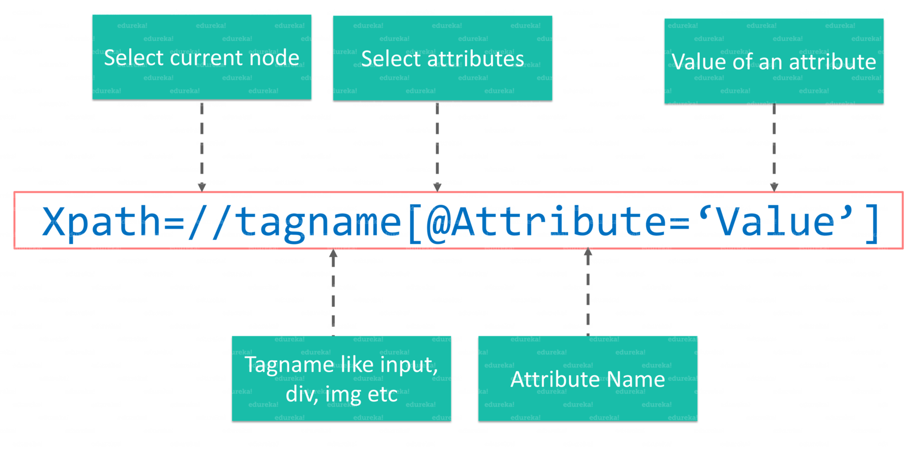
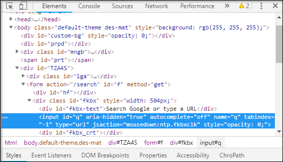
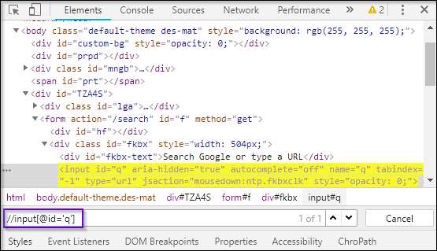
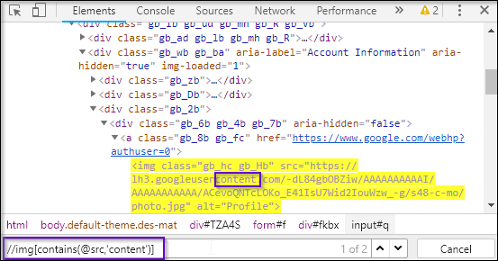
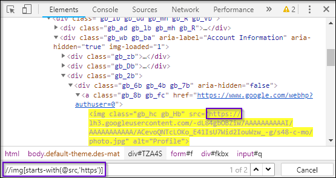
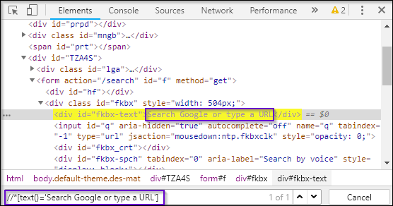
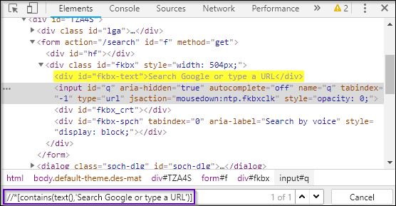
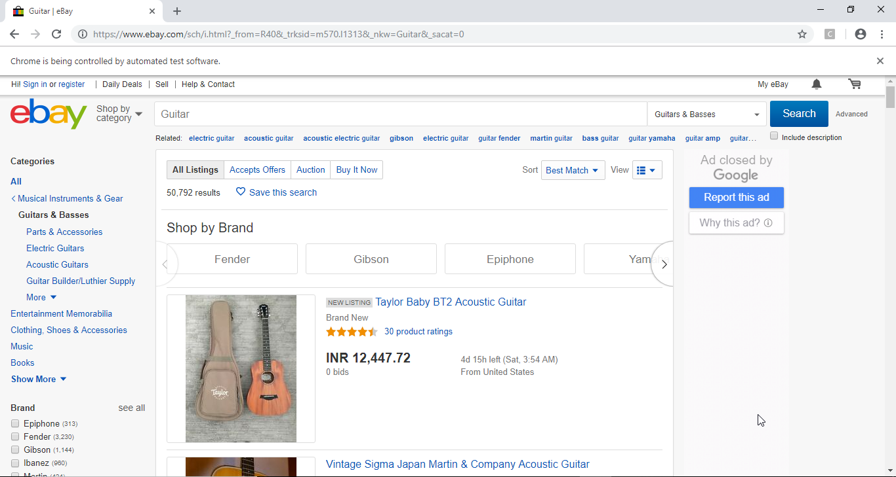

# XPath

<div align="center">
  
  <br />
  <em>The easiest & best way to locate elements on a web page</em>
  <br />
</div>

## Table of Contents

<!-- START doctoc generated TOC please keep comment here to allow auto update -->
<!-- DON'T EDIT THIS SECTION, INSTEAD RE-RUN doctoc TO UPDATE -->

- [What is XPath](#what-is-xpath)
- [XML Document](#xml-document)
- [Syntax of XPath](#syntax-of-xpath)
- [Types of XPath](#types-of-xpath)
  - [Absolute XPath](#absolute-xpath)
  - [Relative XPath](#relative-xpath)
  - [Examples](#examples)
- [XPath Functions](#xpath-functions)
  - [Types of XPath Functions](#types-of-xpath-functions)
    - [`contains()`](#contains)
    - [`starts-with()`](#starts-with)
    - [`text()`](#text)
- [Element Search using Eclipse](#element-search-using-eclipse)
- [References](#references)

<!-- END doctoc generated TOC please keep comment here to allow auto update -->

## What is XPath

XPath also called as XML Path is a language to query XML documents.
It is an important strategy to locate elements in selenium.
It consists of a path expression along with some conditions.
Here, you can easily write XPath script/query to locate any element in the webpage.
It is designed to allow the navigation of XML documents,
with the purpose of selecting individual elements, attributes,
or some other part of an XML document for specific processing.
It also produces reliable locators.

Now, let's understand how to write an XPath for an XML Document.

## XML Document

The XML document has a tree-like structure.
Below figure is an example of an XML document where you have different tags and attributes.
It starts with a tag called the bookstore, which is also an element or a node.

<!-- AUTO-GENERATED-CONTENT:START (CODE:src=labs/bookstore.xml) -->
<!-- The below code snippet is automatically added from labs/bookstore.xml -->

```xml
<bookstore>
  <book category="cooking">
    <title lang="en">Everyday Chinese</title>
    <author>K.S.Bose</author>
  </book>
  <book category="children">
    <title lang="en">Harry Potter</title>
    <author>J.K. Rowling</author>
  </book>
</bookstore>
```

<!-- AUTO-GENERATED-CONTENT:END -->

As you can see here, the Bookstore node has a child node Book.
It is further followed by an attribute called category whose value is Cooking.
And this book node, in turn, has 2 child nodes i.e. Title and Author.
Now, let's visualize this XML document in a tree-like structure.
Here, the book store is a root node which has 2 children of type book.
Category of 1st book type is cooking and 2nd is children.
As you can see in the below figure, both have 2 tags i.e. title and author.

<div align="center"></div>

Here, I will start with the root node i.e. book store,
then I will locate a book whose category is children.
Once I reach the correct node,
the next step will be to pick a node with an author tag.
So XPath can be written like:

```xpath
bookstore/book[@category='children']/author
```

This is an XPath query to locate the author of a book whose category is children.
Now let's understand the syntax of the XPath query.

## Syntax of XPath

Below figure depicts XPath Syntax and its terminology.

<div align="center"></div>

- **`//`**: It is used to select the current node.
- **`tagname`**: It is the name of the tag of a particular node.
- **`@`**: It is used to select to select attribute.
- **`Attribute`**: It is the name of the attribute of the node.
- **`Value`**: It is the value of the attribute

In the next section of this XPath in Selenium article,
I will be talking about different types of XPath with the help of some practical examples.

## Types of XPath

### Absolute XPath

It is the direct way to find the element,
but the disadvantage of the absolute XPath is that,
if there are any changes made in the path of the element then that XPath gets failed.
For example: `/html/body/div[1]/section/div[1]/div`

### Relative XPath

For Relative XPath, the path starts from the middle of the HTML DOM structure.
It begins with the double forward slash (//),
which means it can search the element anywhere at the webpage.
For example: `//input[@id='ap_email']`

### Examples

Now, let's understand this with the help of an example.
I will launch Google Chrome and navigate to google.com.
Here, I will try to locate the search bar using XPath.
On inspecting the web element you can see it has an input tag and attributes like class and id.
Now, I will use the tag name and these attributes to construct XPath
which in turn will locate the search bar.

<div align="center"></div>

Here, you just have to click Elements tab
and press Ctrl + F to open a search box in chromes developers tool.
Next, you can write XPath, string selector and it will try to search based on that criteria.
As you can see in the above image, it has an input tag.

Now I will start with // input. Here //input implies tagname.
Now, I will use the name attribute and pass ‘q’ in single quotes as its value.
This gives XPath expression as below:

```xpath
//input[@name='q']
```

<div align="center"></div>

As you can see in the above image,
on writing the XPath it has highlighted the element
which implies that this particular element was located using XPath.

Now, let's move ahead with this XPath in Selenium article
and understand different functions used in Selenium.

## XPath Functions

Automation using Selenium is definitely a great technology
that provides many ways to identify an object or element on the web page.
But sometimes we do face problems in identifying the objects on a page
which have the same attributes.
Some of such cases can be
elements having the same attributes and names
or having more than one button with the same name and ids.
In such cases, it's challenging to instruct selenium to identify a particular object on a web page
and this is where XPath functions come to our rescue.

### Types of XPath Functions

Selenium is comprised of various functions.
Below, I have listed down three of the most widely used functions:

1. `contains()`
1. `starts-with()`
1. `text()`

First, I will tell you how `contains()` function is being used in XPath query.

#### `contains()`

It is a method used in an XPath expression.
When the value of any attribute changes dynamically
e.g. login information, this method comes into use.
It can locate a web element with the available partial text.
Let me show you how to use `contains()` method.

<div align="center"></div>

I will again open google.com and choose a  tag to inspect its element tab.
So what's next?

As you can see in the above source code snippet,
it has a  tag, followed by its attributes.
Now let's say, I want to locate its src attribute using XPath.
In order to do this, I will start with // followed by input tag,
then I will use the select attribute, followed by its attribute name src.
Finally, I will copy and paste the value of src.
But by doing this, our XPath will become too lengthy.

And, this is one of the biggest reasons for constructing a partial XPath query.
As an src attribute contains the URL in its value,
there are chances that its value or some part of the URL might change while you reload the page.
So the bottom line here is, a part of the attribute value is static while the rest is dynamic,
in such cases, we generally prefer using partial XPath.

XPath query looks like:

```xpath
//img[contains(@src,'content')]
```

Now let's, move further and understand a few more XPath functions.

#### `starts-with()`

This function is used to find a web element whose value of an attribute changes on the refresh
or on any other dynamic operation on the web page.
In this, we match the starting text of the attribute
to locate an element whose attribute has changed dynamically.

For Example: On the web page,
ID of a particular element changes dynamically such as ‘id1’, ‘id2’, ‘id3’, etc.,
but the remaining text will be the same.

Let's now try demonstrating it using the same object.
Here, instead of contains(), you have to change it to starts-with().

<div align="center"></div>

As you can see in the figure src attribute starts with https.
It will locate the elements that start with https.
Thus, this is how starts-with function is used to locate a particular element on the webpage.

XPath query looks like:

```xpath
//img[starts-with(@src,'https')]
```

Now let's understand one more function text().

#### `text()`

This expression is used with the text function to locate an element with exact text.
Let's see a small example to use text().

<div align="center"></div>

Here my condition is –

“go anywhere inside this document, irrespective of the tag,
but, it must contain a text whose value is Search Google or type a URL”.

The asterisk(\*) implies any tag with the same value. This give me an XPath query that looks like:

```xpath
//*[text()='Search Google or type a URL']
```

This is how you can use text() function.
Now let's try to use two functions i.e. contains() and text() together in one XPath query.

<div align="center"></div>

As you can see in the above snippet, first I have used contains(),
and passed the first argument as text().
Now, text() should hold a value Search Google or type a URL.
As you might notice, I have not used @ because the text() is a function
and not an attribute.
This is how you can use two XPath functions together.

In the next section of this article,
we will see how to register the drivers for chrome
and how to send keys to search element using Eclipse.

## Element Search using Eclipse

For google chrome, you need to install a chrome driver in your system.
Now let's take a closer look at the code.
As you can see, I have used System.setproperty() to set the path of chrome driver.
Then I am using driver.get() to navigate to ebay.com.
Further, using the XPath I am locating search box of the webpage.
Now, using sendkeys(), I will be sending the search value as Guitar
to redirect to the particular search page.

```java
package Edureka;
import java.util.concurrent.TimeUnit;
import org.openqa.selenium.By;
import org.openqa.selenium.WebDriver;
import org.openqa.selenium.WebElement;
import org.openqa.selenium.chrome.ChromeDriver;
public class CustomXpath {
public static void main(String[] args) {
System.setProperty("webdriver.chrome.driver", "C:Selenium-java-edurekachromedriver_win32chromedriver.exe");
WebDriver driver = new ChromeDriver();
driver.manage().window().maximize();
driver.manage().deleteAllCookies();
driver.manage().timeouts().pageLoadTimeout(40, TimeUnit.SECONDS);
driver.manage().timeouts().implicitlyWait(30, TimeUnit.SECONDS);
driver.get("<a href="https://www.ebay.com/">https://www.ebay.com/</a>");
driver.findElement(By.xpath("//input[@id='gh-ac']")).sendKeys("Guitar"); //xpath for search box
WebElement searchIcon = driver.findElement(By.xpath("//input[@id='gh-btn']"));//xpath for search button
searchIcon.click();
}
}
```

When you run the above Java program,
chrome driver will launch Google Chrome and redirect to ebay.com
and provide you the preferred search automatically.
You can refer below image for the output:

<div align="center"></div>

I hope this gives you a clear understanding of how XPath in Selenium works.
Thus, it brings us to the end of this article.

If you wish to learn Selenium and build a career in the testing domain,
then check out our interactive, live-online Selenium Certification Training here,
that comes with 24\*7 support to guide you throughout your learning period.

Got a question for us? Please mention it in the comments section of XPath in Selenium blog
and we will get back to you.

## References

- [How to Get Started with XPath in Selenium](https://www.edureka.co/blog/xpath-in-selenium)
- [Xpath in Selenium | Selenium Xpath Tutorial | Selenium Xpath Examples](https://www.youtube.com/watch?v=9-iVt0MIqNY)
