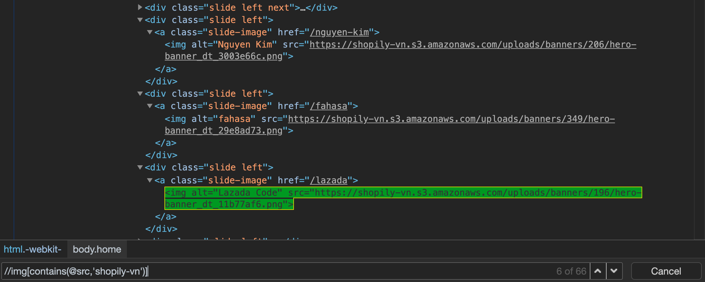

# XPath

<div align="center">
  
  <br />
  <div>The <b>best way</b> to <b>locate elements</b> on a <b>webpage</b></div>
  <br />
</div>

## Table of Contents

<!-- START doctoc generated TOC please keep comment here to allow auto update -->
<!-- DON'T EDIT THIS SECTION, INSTEAD RE-RUN doctoc TO UPDATE -->

- [What is XPath](#what-is-xpath)
- [IntelliJ-Based IDEs](#intellij-based-ides)
  - [XPath Expression Evaluation](#xpath-expression-evaluation)
  - [XPath Expression Generation](#xpath-expression-generation)
  - [XPath Search](#xpath-search)
- [Syntax of XPath](#syntax-of-xpath)
- [Types of XPath](#types-of-xpath)
  - [Absolute XPath](#absolute-xpath)
  - [Relative XPath](#relative-xpath)
- [Chrome DevTools](#chrome-devtools)
  - [Copy Full XPath](#copy-full-xpath)
  - [Copy XPath](#copy-xpath)
  - [Find Elements by XPath](#find-elements-by-xpath)
  - [Evaluate XPath Expressions](#evaluate-xpath-expressions)
- [XPath Functions](#xpath-functions)
  - [`contains()`](#contains)
  - [`starts-with()`](#starts-with)
  - [`text()`](#text)
- [Demo: Selenium ChromeDriver](#demo-selenium-chromedriver)
- [References](#references)

<!-- END doctoc generated TOC please keep comment here to allow auto update -->

## What is XPath

> `XPath` is also called as `XML Path`, a **language** to **query XML documents**.

<br />

<!-- AUTO-GENERATED-CONTENT:START (CODE:src=labs/bookstore.xml) -->
<!-- The below code snippet is automatically added from labs/bookstore.xml -->

```xml
<!-- An example of an XML document where you have different "tags" and "attributes" -->
<!-- Start with a "tag" called the "bookstore", which is also an "element" or a "node" -->
<bookstore>
  <book category="cooking">
    <title lang="en">Everyday Chinese</title>
    <author>K.S.Bose</author>
  </book>
  <book category="children">
    <title lang="en">Harry Potter</title>
    <author>J.K. Rowling</author>
  </book>
</bookstore>
```

<!-- AUTO-GENERATED-CONTENT:END -->

<div align="center">
  
  <br />
  <div>Visualize the XML document in a tree-like structure</div>
  <br />
</div>

<br />

Here is an **XPath query** to locate the `author` of a `book` which `category` is `children`:

```xpath
/bookstore/book[@category='children']/author
```

## IntelliJ-Based IDEs

### [XPath Expression Evaluation](https://www.jetbrains.com/help/idea/xpath-expression-evaluation.html)

> An XPath expression needs evaluation to test it
> before using in program code
> or before making structured queries against XML documents.

```xpath
/bookstore/book[@category='children']/author
```

<div align="center"></div>
<div align="center"></div>

### [XPath Expression Generation](https://www.jetbrains.com/help/idea/xpath-expression-generation.html)

> This action computes a unique XPath expression
> that matches the currently selected node in the document.

<div align="center"></div>

### [XPath Search](https://www.jetbrains.com/help/idea/xpath-search.html)

> Find occurrences of certain XPath expressions in all XML files in a specific scope.

```xpath
/bookstore/book[@category='children']/author
```

<div align="center"></div>
<div align="center"></div>

## Syntax of XPath

Below figure depicts XPath Syntax and its terminology.

<div align="center"></div>

|   Terminology   | Description                               |
| :-------------: | ----------------------------------------- |
|    **`//`**     | Used to select the current node.          |
|  **`tagname`**  | The name of the tag of a particular node. |
|     **`@`**     | Used to select attribute.                 |
| **`Attribute`** | The name of the attribute of the node.    |
|   **`Value`**   | The value of the attribute.               |

## Types of XPath

### Absolute XPath

- Example: `/html/body/div[1]/section/div[1]/div`.
- It is the direct way to find the element,
  but the disadvantage of the absolute XPath is that,
  if there are any changes made in the path of the element then that XPath gets failed.

### Relative XPath

- Example: `//input[@id='ap_email']`.
- For Relative XPath, the path starts from the middle of the HTML DOM structure.
  It begins with the double forward slash (`//`),
  which means it can search the element anywhere at the webpage.

## Chrome DevTools

1. Launch **Google Chrome** and navigate to <https://www.goshopback.vn/>.
1. Try to **Inspect** a random web element.

<div align="center"></div>

<br />

<div align="center"></div>

### Copy Full XPath

> Returns an **Absolute XPath**.

```xpath
/html/body/div[1]/div[5]/div/div/div/section/section[7]/section/div/section/div[1]/a/img
```

### Copy XPath

> Returns a **Relative XPath**.

```xpath
//*[@id="home-page-container"]/div/div/section/section[7]/section/div/section/div[1]/a/img
```

<br />

### Find Elements by XPath

- On the `Elements` panel, press `Command-F` to open a **search box**.

<div align="center"></div>

<br />

- Starting with `//`, we will use `img` as a `tagname` and `class` as an `attribute`
  to construct an XPath expression.

```xpath
//img[@class='brand-image']
```

<div align="center">
  
  <br />
  <div>The located elements are highlighted</div>
</div>

### Evaluate XPath Expressions

`$x(path)` returns an array of DOM elements that match the given XPath expression.

- Select the `Console` tab, and check the XPath by typing `$x("your_xpath_here")`.
  This will return an array of matched values.
  If it is empty, you know there is no match on the page.

```js
$x("//img[@class='brand-image']");
```

<div align="center"></div>

## XPath Functions

- Sometimes we do face problems in identifying the objects on a page
  which having the same attributes or names, ids.
- In such cases, it is challenging to identify a particular object on a web page
  and this is where XPath functions come to our rescue.

### `contains()`

The contains function determines whether the first argument string contains the second argument string
and returns boolean true or false.

```xpath
contains(haystack, needle)
```

- haystack: the string to be searched
- needle: the string to look for as a substring of haystack.

It is a method used in an XPath expression.
When the value of any attribute changes dynamically
e.g. login information, this method comes into use.
It can locate a web element with the available partial text.
Let me show you how to use `contains()` method.

I will again open google.com and choose a  tag to inspect its element tab.
So what's next?

As you can see in the above source code snippet,
it has a  tag, followed by its attributes.
Now let's say, I want to locate its src attribute using XPath.
In order to do this, I will start with // followed by input tag,
then I will use the select attribute, followed by its attribute name src.
Finally, I will copy and paste the value of src.
But by doing this, our XPath will become too lengthy.

And, this is one of the biggest reasons for constructing a partial XPath query.
As an src attribute contains the URL in its value,
there are chances that its value or some part of the URL might change while you reload the page.
So the bottom line here is, a part of the attribute value is static while the rest is dynamic,
in such cases, we generally prefer using partial XPath.

XPath query looks like:

```xpath
//img[contains(@src,'shopily-vn')]
```

<div align="center"></div>

### `starts-with()`

The starts-with checks whether the first string starts with the second string
and returns true or false.

```xpath
starts-with(haystack, needle)
```

This function is used to find a web element whose value of an attribute changes on the refresh
or on any other dynamic operation on the web page.
In this, we match the starting text of the attribute
to locate an element whose attribute has changed dynamically.

For Example: On the web page,
ID of a particular element changes dynamically such as ‘id1’, ‘id2’, ‘id3’, etc.,
but the remaining text will be the same.

Let's now try demonstrating it using the same object.
Here, instead of `contains()`, you have to change it to `starts-with()`.

<div align="center"></div>

As you can see in the figure src attribute starts with https.
It will locate the elements that start with https.
Thus, this is how starts-with function is used to locate a particular element on the webpage.

XPath query looks like:

```xpath
//img[starts-with(@src,'https')]
```

### `text()`

This expression is used with the text function to locate an element with exact text.
Let's see a small example to use text().

```xpath
//*[text()='Made with love by']
```

<div align="center"></div>

Here my condition is:

- Go anywhere inside this document, irrespective of the tag,
  but, it must contain a text whose value is `Made with love by`.

<br />

```xpath
//*[text()='Made with love']
```

<div align="center"></div>

The asterisk (`*`) implies any tag with the same value. This give me an XPath query that looks like:

This is how you can use text() function.
Now let's try to use two functions i.e. contains() and text() together in one XPath query.

<div align="center"></div>

```xpath
//*[contains(text(), 'Made with love')]
```

As you can see in the above snippet, first I have used contains(),
and passed the first argument as text().
Now, text() should hold a value Search Google or type a URL.
As you might notice, I have not used @ because the text() is a function
and not an attribute.
This is how you can use two XPath functions together.

In the next section of this article,
we will see how to register the drivers for chrome
and how to send keys to search element using Eclipse.

## Demo: Selenium ChromeDriver

- You need to install a [Chrome Driver](https://github.com/giggio/node-chromedriver) in your system.

```shell script
npm --global install chromedriver
```

<!-- AUTO-GENERATED-CONTENT:START (CODE:src=labs/ebay/package.json) -->
<!-- The below code snippet is automatically added from labs/ebay/package.json -->

```json
{
  "name": "ebay",
  "version": "1.0.0",
  "license": "MIT",
  "dependencies": {
    "selenium-webdriver": "3.6.0",
    "sleep": "6.1.0"
  }
}
```

<!-- AUTO-GENERATED-CONTENT:END -->

<!-- AUTO-GENERATED-CONTENT:START (CODE:src=labs/ebay/index.js) -->
<!-- The below code snippet is automatically added from labs/ebay/index.js -->

```js
const { Builder, By } = require("selenium-webdriver");
const sleep = require("sleep");

(async function main() {
  const driver = await new Builder().forBrowser("chrome").build();

  driver.manage().window().setSize(1280, 720);
  driver.manage().deleteAllCookies();

  try {
    // Navigate to ebay.com
    await driver.get("https://www.ebay.com");

    // By using XPath, we are able to locate the search box
    // sendKeys() to search for a value of "DevOps"
    await driver.findElement(By.xpath("//input[@id='gh-ac']")).sendKeys("DevOps");

    // Hit the search button to redirect to the results page
    await driver.findElement(By.xpath("//input[@id='gh-btn']")).click();

    sleep.sleep(5);
  } finally {
    driver.quit();
  }
})();
```

<!-- AUTO-GENERATED-CONTENT:END -->

<br />

```shell script
cd labs/ebay
npm install
node .
```

<div align="center">
  
  <br />
  <div><b>Chrome Driver</b> will launch <b>Google Chrome</b> and redirect to ebay.com</div>
  <div>Providing the preferred search automatically</div>
  <br />
</div>

## References

- [How to Get Started with XPath in Selenium](https://www.edureka.co/blog/xpath-in-selenium)
- [Xpath in Selenium | Selenium Xpath Tutorial | Selenium Xpath Examples](https://www.youtube.com/watch?v=9-iVt0MIqNY)
- [XPath in Selenium WebDriver](https://www.guru99.com/xpath-selenium.html)
- [XPath Functions](https://developer.mozilla.org/en-US/docs/Web/XPath/Functions)
